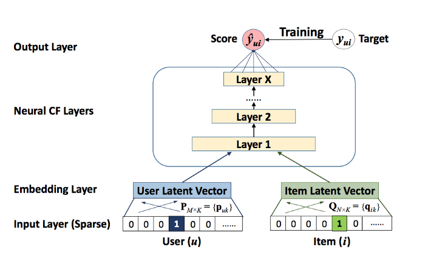

# Data Science Session: Recommender Systems


This session shows how to:
- Build deep learning based recommender models with Collie framework
- Train different models on implicit feedback: 
  - Matrix Factorization
  - Neural Collaborative Filtering
  - Hybrid Multi Stage
- Train Matrix Factorization on explicit feedback
- Make similar item prediction (for new items)

#### Pre-requirements
- python 3.8
- pip

#### Requirements
```bash
pip install -r requirements.txt
```
---
**Speaker:** Raid Arfua
